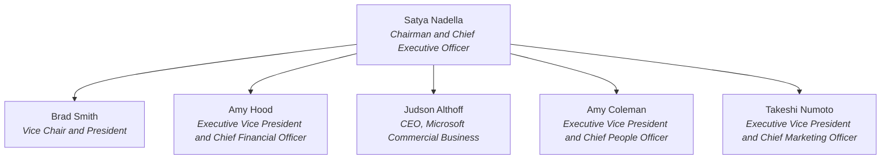

# exec-company-org-chart

**A level-1 org chart for any company — from just its name. No data feeding. No CSV.**

Existing org-chart skills render data you already have. This skill is for the far
more common case: **you have nothing but a company name.** It researches the
company's *own official pages* (or official PDFs — common in Japan, China, APAC,
India, and government bodies), extracts the top leader and executive team with
**verbatim titles and a source link per person**, and renders a Mermaid chart plus
a roster table.

## Install

```sh
npx skills add asheSky/exec-company-org-chart
```

## Use

Just ask your agent:

> "Org chart for Microsoft"
> "Who runs costco.com.au?"
> "Map the leadership team for this account: Zerodha"

Optionally pass a website domain as the grounding anchor — when given, the skill
charts exactly that entity and never "corrects" you to global HQ.

## What makes it different

- **Zero input data** — name in, sourced chart out (vs. CSV-fed generators)
- **Official sources only** — the company's own site and documents; LinkedIn,
  news, and aggregators are banned by design
- **A source link on every person** + an as-of date on every chart
- **Refuses instead of guessing** — ambiguous name, no leadership disclosure,
  unreadable source → you get an honest fallback with next steps, never a
  plausible-looking wrong chart
- **Region-aware** — Executive Committee, Management Board, Managing Officer,
  Executive General Manager… the company's own vocabulary wins; PDF disclosures
  are in scope
- **Level-1 by design** — top leader + executive team. Public sources aren't
  reliable deeper, so deeper isn't offered.

## Example output (from a live run)

> **Ask:** "Org chart for Microsoft"

### Microsoft — Executive Team
Official source: microsoft.com · As of 2026-07-21



| # | Name | Title (verbatim) | Source |
|---|------|------------------|--------|
| 1 | Satya Nadella | Chairman and Chief Executive Officer | [news.microsoft.com/source/leadership](https://news.microsoft.com/source/leadership/) |
| 2 | Brad Smith | Vice Chair and President | [same](https://news.microsoft.com/source/leadership/) |
| 3 | Amy Hood | Executive Vice President and Chief Financial Officer | [same](https://news.microsoft.com/source/leadership/) |
| 4 | Judson Althoff | CEO, Microsoft Commercial Business | [same](https://news.microsoft.com/source/leadership/) |
| 5 | Amy Coleman | Executive Vice President and Chief People Officer | [same](https://news.microsoft.com/source/leadership/) |
| 6 | Takeshi Numoto | Executive Vice President and Chief Marketing Officer | [same](https://news.microsoft.com/source/leadership/) |

**Notes:** Microsoft's page defines "Executive Officers" as its executive group — that set is the chart. Its Board of Directors section is excluded by rule.

**Receipt:** 6 executives · source: page · microsoft.com · as of 2026-07-21

The skill was validated against an 8-case live test matrix — a JS-walled site, a
bot-blocked site, a holding company, Japanese governance titles, a PDF-only
disclosure, a founder-led startup, and a nonexistent company (which it correctly
refused to chart). Full results: [`specs/001-exec-org-chart/test-results.md`](specs/001-exec-org-chart/test-results.md).

## How it was built

Spec-driven, not vibe-coded: the constitution, spec, plan, and task list that
produced this skill are in [`memory/`](memory/) and [`specs/`](specs/) — the skill
is the implementation of those artifacts.

## License

MIT
